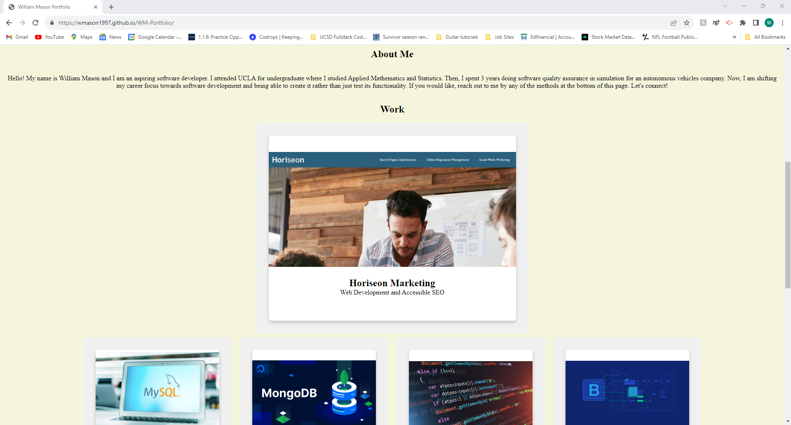
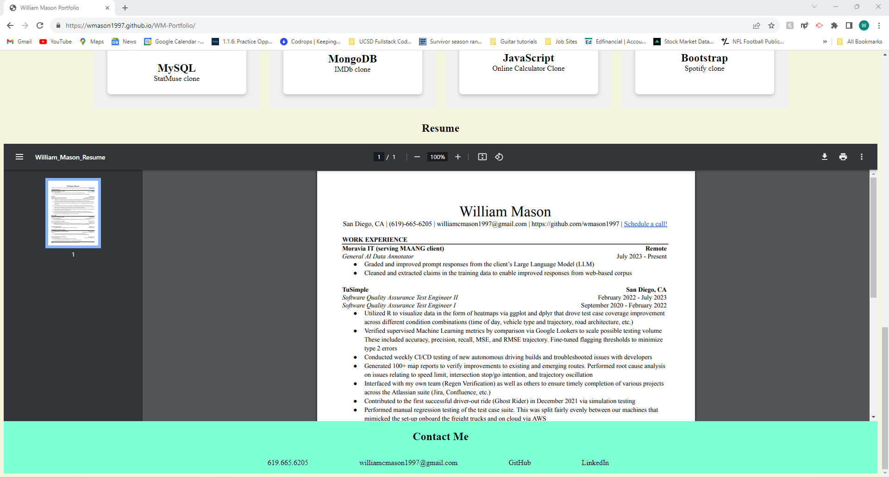

# WM-Portfolio #

## Description ##
With what I have learned so far through 3 weeks of the course, I have designed a responsive website template to update as I
create more projects along the way. Hopefully, this portfolio website will serve me well in my future career search and moreover
be a fun place to share my new personal projects.

## Credits ##
I learned how to embed a resume from [How to Embed PDF Document in HTML Webpage](https://www.codexworld.com/embed-pdf-document-file-in-html-web-page/#:~:text=Generally%2C%20a%20hyperlink%20is%20used,document%20on%20the%20web%20page). I also used ChatGPT to help me get the images, when clicked, lead
to the place-holder websites as well as other styling details. The placeholder websites I used were StatMuse for MySQL, IMDb for MongoDB, an Online Calculator for JavaScript, and 
Spotify for Bootstrap.

I had a tutoring session with Corrado Alfano on 10/15 where he helped me to understand flexbox better.

## Screenshots ##

## Link to Deployed Application ##
[William Mason Portfolio](https://wmason1997.github.io/WM-Portfolio/)